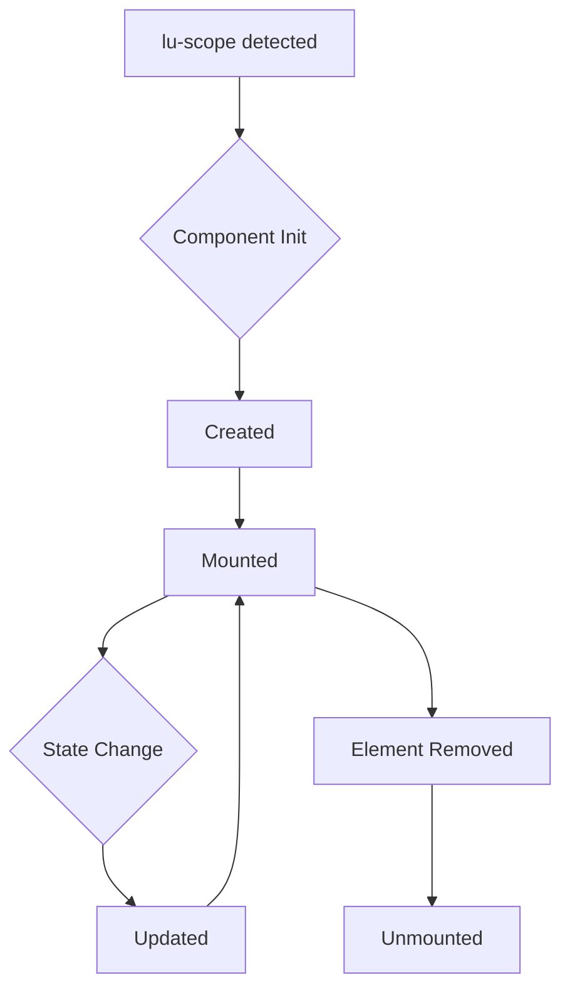

# Components and Lifecycle Events

In Lune, components are simplified compared to standard Vue. They are primarily functions that return a scope object.

## Function Components

Reusable scope logic can be created with functions:

```js
function Counter(props) {
  return {
    count: props.initialCount,
    inc() {
      this.count++;
    },
    onMounted() {
      console.log(`I'm mounted!`);
    }
  };
}

createApp({
  Counter
}).mount();
```

### Usage

Use the function in `lu-scope` to instantiate the component:

```html
<div lu-scope="Counter({ initialCount: 1 })" @lune:mounted="onMounted">
  <p>{{ count }}</p>
  <button @click="inc">increment</button>
</div>

<div lu-scope="Counter({ initialCount: 2 })">
  <p>{{ count }}</p>
  <button @click="inc">increment</button>
</div>
```

> [!NOTE]
> Lune does **not** have automatic lifecycle hooks like `mounted()` or `setup()`. To run code when a component is mounted, define a method in your scope and wire it up manually using `@lune:mounted="methodName"`. See [Lifecycle Events](#lifecycle-events) for details.

## Components with Template

If you want to reuse a piece of template, you can provide a special `$template` key on the scope object. The value can be an ID selector to a `<template>` element:

```js
function Counter(props) {
  return {
    $template: "#counter-template",
    count: props.initialCount,
    inc() {
      this.count++;
    }
  };
}
```

```html
<template id="counter-template">
  My count is {{ count }}
  <button @click="inc">++</button>
</template>

<!-- reuse it -->
<div lu-scope="Counter({ initialCount: 1 })"></div>
<div lu-scope="Counter({ initialCount: 2 })"></div>
```

The `<template>` approach is recommended over inline strings because it is more efficient to clone from a native template element.

## Organizing Code

For larger projects, it's best to keep your component logic in separate JavaScript files.

`components/Counter.js`:

```js
export default function Counter(props) {
  return {
    count: props.initialCount || 0,
    inc() {
      this.count++;
    },
    dec() {
      this.count--;
    }
  };
}
```

`index.html`:

```html
<script type="module">
  import { createApp } from "https://esm.run/lune-js";
  import Counter from "./components/Counter.js";

  createApp({
    Counter
  }).mount();
</script>

<div lu-scope="Counter({ initialCount: 10 })">...</div>
```

## Lifecycle Events

Lune provides special lifecycle events that you can listen to on any element:

- `@lune:mounted`: Fired when the element is mounted and directives are initialized.
- `@lune:unmounted`: Fired when the element is unmounted (e.g., via `lu-if`).

### Usage

```html
<div lu-scope="{ show:false }">
  <button type="button" @click="show = !show">show</button>
  <div lu-if="show" @lune:mounted="console.log('mounted on: ', $el)" @lune:unmounted="console.log('unmounted: ', $el)">
    I am visible
  </div>
</div>
```

## Practical Use Cases

### Auto-focus Input

```html
<input @lune:mounted="$el.focus()" />
```

### Integrating 3rd Party Libraries

You can use `@lune:mounted` to initialize jQuery plugins or other libraries on the element. A library
is not reachable from a template just because it is a global — put it in the app data, or register it
with [`allowGlobals`](/advanced/security#application-globals):

```js
import Pikaday from "pikaday";

createApp({ Pikaday }).mount();
```

```html
<div @lune:mounted="new Pikaday({ field: $el })">
  <input type="text" />
</div>
```

A component function is the other way around it, since the function body is ordinary JavaScript:

```js
function DatePicker() {
  return {
    init($el) {
      new Pikaday({ field: $el });
    }
  };
}

createApp({ DatePicker }).mount();
```

```html
<div lu-scope="DatePicker()" @lune:mounted="init($el)">
  <input type="text" />
</div>
```

### Cleanup

Use `@lune:unmounted` to clean up event listeners or timers to prevent memory leaks.

## Lifecycle Diagram

Here is a visualization of the component lifecycle:



> [!NOTE]
> `lu-effect` watchers are automatically disposed of when the component is unmounted.
